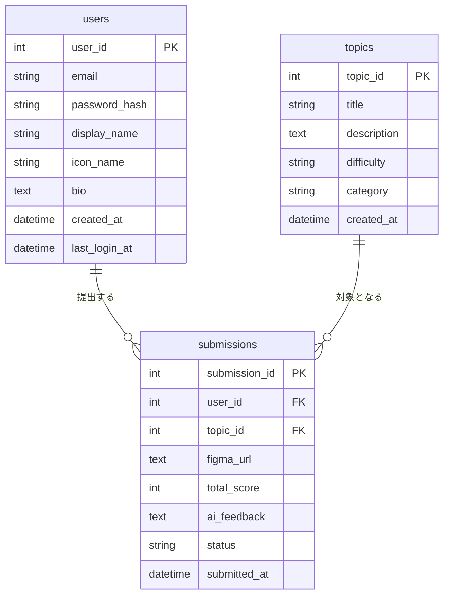
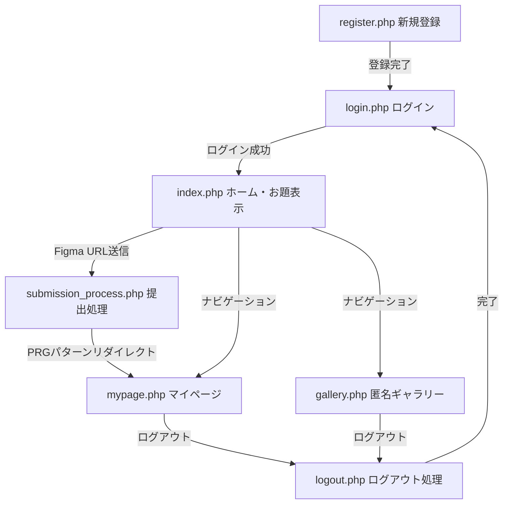

これまでの設計議論およびセキュリティ監査（壁打ち）の内容をすべて反映・統合した『セキュリティ強化型詳細設計書』を作成しました。

以下の内容をコピーして、ローカル環境のVSCode等に **`03_detailed_design.md`** というファイル名で保存してください。

---

# デザトレ（DesaTre） セキュリティ強化型詳細設計書

## 1. 開発基本方針

* **アーキテクチャ・実装モデル：** シンプルな画面・処理分離型構造（共通関数・DB接続・セキュリティ設定を別ファイル化し、各ページで読み込むモデル）
* **データベース名：** `desatre_db`
* **ドキュメントルート：** `/desatre/`（アクセスURL: `http://localhost/desatre/`）
* **命名規則：**
* **データベース（テーブル名・カラム名）：** 小文字のスネークケース（例: `user_id`, `password_hash`, `topic_id`）
* **PHPファイル名：** 小文字のスネークケースまたは単一の英単語（例: `submission_process.php`, `mypage.php`）
* **PHP変数・関数名：** キャメルケースまたはスネークケース（例: `$userId`, `$stmt`, `h()`）


---

## 2. データベース設計

### ① ER図（Mermaid表記）



※補足：`users` テーブルから `submissions`（1対多）、`topics` テーブルから `submissions`（1対多）へのリレーション構造となっています。

### ② テーブル定義書

#### 1. `users` テーブル（ユーザー情報）

| カラム名 | データ型 | 制約 | 説明 |
| --- | --- | --- | --- |
| `user_id` | INT | PRIMARY KEY, AUTO_INCREMENT | ユーザー一意識別子 |
| `email` | VARCHAR(255) | UNIQUE, NOT NULL | ログイン用メールアドレス |
| `password_hash` | VARCHAR(255) | NOT NULL | `password_hash()` で生成した暗号化文字列 |
| `display_name` | VARCHAR(50) | NOT NULL | 画面表示名 |
| `icon_name` | VARCHAR(100) | DEFAULT 'default.png' | アバターアイコン画像ファイル名 |
| `bio` | TEXT | NULL | ひとこと自己紹介文 |
| `created_at` | DATETIME | DEFAULT CURRENT_TIMESTAMP | アカウント登録日時 |
| `last_login_at` | DATETIME | NULL | 最終ログイン日時 |

#### 2. `topics` テーブル（お題マスタ）

| カラム名 | データ型 | 制約 | 説明 |
| --- | --- | --- | --- |
| `topic_id` | INT | PRIMARY KEY, AUTO_INCREMENT | お題一意識別子 |
| `title` | VARCHAR(100) | NOT NULL | お題タイトル |
| `description` | TEXT | NOT NULL | お題の詳細指示文 |
| `difficulty` | VARCHAR(20) | NOT NULL | 難易度（初級 / 中級 / 上級） |
| `category` | VARCHAR(50) | NOT NULL | デザインカテゴリ（配色 / レイアウト / タイポグラフィ等） |
| `created_at` | DATETIME | DEFAULT CURRENT_TIMESTAMP | お題作成日時 |

#### 3. `submissions` テーブル（提出＆AI評価データ）

| カラム名 | データ型 | 制約 | 説明 |
| --- | --- | --- | --- |
| `submission_id` | INT | PRIMARY KEY, AUTO_INCREMENT | 提出一意識別子 |
| `user_id` | INT | NOT NULL, FOREIGN KEY (`users.user_id`) | 提出者のユーザーID |
| `topic_id` | INT | NOT NULL, FOREIGN KEY (`topics.topic_id`) | 挑戦したお題のID |
| `figma_url` | TEXT | NOT NULL | 提出されたFigma共有URL |
| `total_score` | INT | NOT NULL | 模擬AI算出スコア（75〜95） |
| `ai_feedback` | TEXT | NOT NULL | 模擬AI生成フィードバック本文 |
| `status` | VARCHAR(20) | DEFAULT 'submitted' | 状態（`submitted` 等） |
| `submitted_at` | DATETIME | DEFAULT CURRENT_TIMESTAMP | 提出日時 |

---

## 3. 画面遷移図・制御フロー

### ① 画面遷移図（Mermaid表記）



### ② PRGパターンの適用箇所とCSRFトークンの検証フロー

1. **フォーム表示時（`index.php`, `register.php`, `login.php`）：**
* サーバー側で暗号学的に安全な疑似乱数（`random_bytes(32)`）を用いてワンタイムCSRFトークンを発行し、`$_SESSION['csrf_token']` に保持。
* HTMLフォーム内に `<input type="hidden" name="csrf_token" value="...">` として埋め込み。


2. **POST受信・検証処理（`submission_process.php` 等）：**
* 送信された `$_POST['csrf_token']` と `$_SESSION['csrf_token']` を `hash_equals()` 関数で比較・判定。
* 不一致の場合は即座に処理を中断し、エラー応答を返す（CSRF遮断）。


3. **PRG（Post-Redirect-Get）パターンの適用：**
* 提出処理完了後、ブラウザの「再読み込みによる二重投稿（F5アタック）」を防ぐため、`header('Location: mypage.php'); exit;` によりGETリクエストへリダイレクトさせて画面遷移を完結させる。

4. **お題動的生成アルゴリズム (`index.php`)**:
   * 実務に即した具体的デザインパーツ（飲食トップページ、ポートフォリオヘッダー、LPヒーロー等）をパラメータ（`GET['generate']`）に基づき即座に再生成・提供。
5. **AI評価出力フォーマットの構造化**:
   * 【視認性・余白】【タイポグラフィ】【CVR・導線視点】【コンポーネント設計】等の明確なカテゴリタグを付与し、数値指定（例：44×44px、24px等の具体的ピクセル数）を含む改善アクション文面を動的生成。

6. **URL決定論的ハッシュおよび連続評価ロジック**:
   * `crc32($figmaUrl . '_' . $persona)` を用いて同一URL・同一ペルソナ時のベーススコア固定化と再現性を担保。
   * `SELECT * FROM submissions WHERE user_id = :user_id AND figma_url = :figma_url` により前回提出レコードを取得。履歴存在時は前回の `total_score` をベースとした改善加点および前線比較文章（【前回からの改善度の判定】/【再提出による効果検証】等）を出力。

---

## 4. ディレクトリ・ファイル構成（VSCode対応）

## 1. システムディレクトリ構造

```text
desatre/
├── config/
│   └── db.php                # DB接続設定（PDO）
├── functions/
│   └── helpers.php           # エスケープ処理・認証チェック等の共通関数
├── css/
│   └── style.css             # 全画面共通スタイリング（新規追加）
├── index.php                 # ホーム / お題提出画面
├── submission_process.php    # 課題提出・AIスコア判定処理
├── gallery.php               # 提出作品ギャラリー画面
├── mypage.php                # マイページ（履歴・スタッツ表示）
├── register.php              # 新規会員登録画面
├── login.php                 # ログイン画面
└── logout.php                # ログアウト処理

（〜これまでの DB設計やAPI仕様などの内容〜）


## 4. UI / フロントエンドスタイリング詳細設計

### 4.1 シックテーマ・CSS設計仕様 (`css/style.css`)
* **カラーパレット（CSS Root Variables）**:
  * メイン背景色: `#0f172a` (ダークスレート)
  * カード・コンテナ背景色: `#1e293b` (チャコール)
  * プライマリカラー: `#3b82f6` (スチールブルー)
  * アクセントカラー: `#d97706` (シックゴールド)
  * テキスト色: `#f1f5f9` (オフホワイト)
  * サブテキスト色: `#94a3b8` (くすみシルバー)
  * 枠線色: `#334155`
* **主要コンポーネントクラス**:
  * `.container`: 最大幅 `920px` のダークコンテナ。落ち着いた角丸 `12px` と深みのある影を適用。
  * `.card-grid`: `display: grid; grid-template-columns: repeat(auto-fill, minmax(280px, 1fr));` による自動レスポンシブ配置。
  * `.card`: シックなトーンの個別カード。ホバー時に `translateY(-4px)` とボーダー色の変化でフィードバック。
  * `.score-badge`: `#334155` の落ち着いたマット調スコアバッジ。


### 4.2 画面別適用コンポーネント詳細

| 画面名 (`.php`) | 適用スタイリング・クラス構成 |
| :--- | :--- |
| `index.php` | `.app-header`, `.container`, `.form-group`, `select`, `input[type="url"]` |
| `mypage.php` | `.app-header`, `.container`, `.card` (スタッツ用Flex配置), `table`, `.score-badge` |
| `login.php` | `.container` (幅420px中央寄せ), `.form-group`, `input[type="email"]`, `input[type="password"]` |
| `register.php` | `.container` (幅420px中央寄せ), `.form-group`, エラー時メッセージボックス（赤透過背景） |
---


## 5. データ整合性・セキュリティ仕様の設計（★成果まとめ）

### ① 脆弱性対策ポリシー

* **SQLインジェクション対策（SQLi）：**
* 動的パラメータを含むSQL文は、例外なくすべてPDOの **プリペアドステートメント（Prepared Statement）** を使用。
* 値の埋め込みには名前付きプレースホルダー（例: `:email`, `:user_id`）を用い、変数文字列の直接結合（`$sql = "... " . $val`）を全コードで禁止。


* **クロスサイトスクリプティング対策（XSS）：**
* ユーザー入力値（`display_name`, `bio`, `figma_url`）およびDBからの取得値をHTMLに出力する箇所では、共通エスケープ関数 `h()`（内部で `htmlspecialchars($str, ENT_QUOTES, 'UTF-8')` を実行）を徹底適用。


* **クロスサイトリクエストフォージェリ対策（CSRF）：**
* 状態変更を伴うすべての `POST` フォーム処理において、ワンタイムトークンの生成と `hash_equals()` による厳密な一致検証を必須化。


* **エラー情報の保護（情報漏洩防止）：**
* DB接続時およびSQL実行時の例外（`PDOException`）は `try-catch` で確実に捕捉。
* 生のDBエラーメッセージ（接続パスやテーブル情報）はサーバーログ（`error_log()`）へ記録し、ユーザーブラウザ画面には「システムエラーが発生しました」等の汎用メッセージのみを出力。


### ② 権限管理とセッション保護設計

* **セッション固定攻撃（Session Fixation）対策：**
* ログイン処理成功直後（`login.php`）に必ず `session_regenerate_id(true)` を呼び出し、既存のセッションIDを破棄して新規IDを付与。


* **アクセス制御・認可チェック（IDOR対策）：**
* ログイン必須ページ（`index.php`, `mypage.php`, `gallery.php`, `submission_process.php`）の先頭で、セッション（`$_SESSION['user_id']`）の存在を確認する認証関数を実行。未ログイン時は `login.php` へ強制リダイレクト。
* 自分の提出データやプロフィールを更新・参照する処理では、リクエストされたデータの所有者キー（`submissions.user_id`）と現在ログイン中の `$_SESSION['user_id']` が一致しているかをサーバー側で厳密に検証。


---

詳細設計書の出力が完了しました。この内容をコピーして、ローカルに『03_detailed_design.md』というファイル名でVSCode等に保存してください。